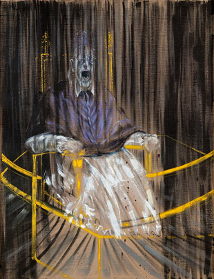
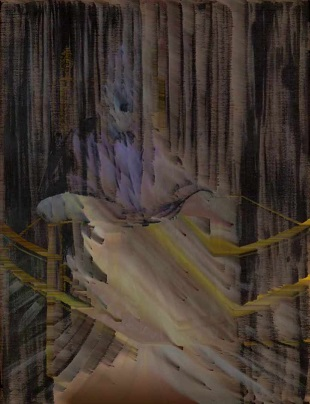

ORIGINAL TUT
**Pixel Sorting – TouchDesigner Tutorial 15**

by
**Bileam Tschepe**

ALLTD
https://t1p.de/cea8q9

YouTube
https://youtu.be/xasLIEw23zY

Note
A little change in keyboard command (press key "1" to start the pixel sorting).For other changes, read comments in operators.

Test image 
*Study after Velázquez’s Portrait of Pope Innocent X*, Francis Bacon, 1953. From *Francis Bacon - Teaching and Learning Resource*, free PDF distributed by official Francis Bacon site, https://t1p.de/lc8bca.

Recoded on
*June 9 2020*

