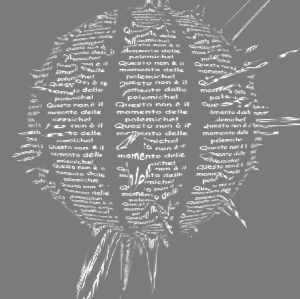

**ORIGINAL TUT** Text Textures – TouchDesigner Tutorial 9

**BY** Bileam Tschepe (AKA Elekktronaut)

**URL ALLTd** https://t1p.de/uqywzh

**URL YouTube** https://youtu.be/kosFgK7DdCo

**RECODED BY** Davide Riboli

**DATE** June 12 2020

**NOTES** Few variations from original: just a switch, some colors and a torus. This file is till 10:00 (more or less) of the original tut. No instancing (for instancing, check the 02b folder).

**OUTPUT PREVIEW** 