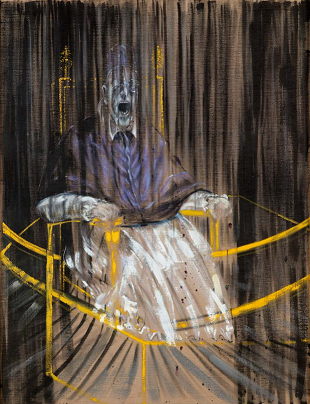

**ORIGINAL TUT** 
Pixel Sorting – TouchDesigner Tutorial 15

**BY** 
Bileam Tschepe

**URL ALLTd** 
https://t1p.de/cea8q9

**URL YouTube** 
https://youtu.be/xasLIEw23zY

**RECODED BY** 
Davide Riboli

**NOTES** 
A little change in keyboard command (press key "1" to start the pixel sorting). 
Other changes: read comments in operators.

**TEST IMAGE**  
*Study after Velázquez’s Portrait of Pope Innocent X*, Francis Bacon, 1953.

From *Francis Bacon - Teaching and Learning Resource*, free PDF distributed by official Francis Bacon site, https://t1p.de/lc8bca.

**DATE** 
June 9 2020

