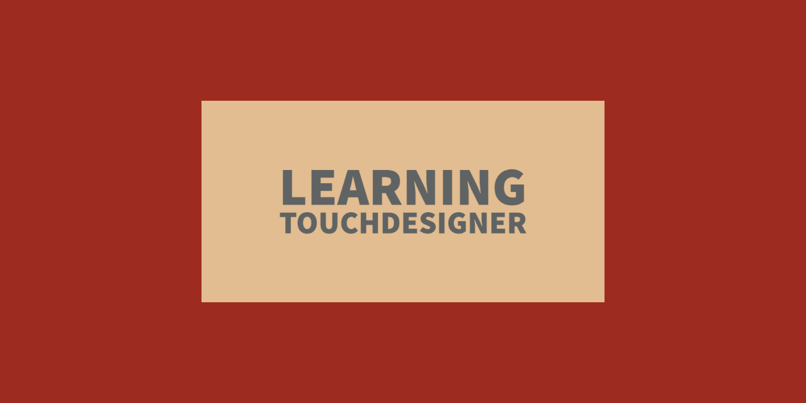

# Learning Touchdesigner
*Touchdesigner resources*

Ever since I discovered and started using [Touchdesigner](https://derivative.ca/), I have lost interest in any other creative coding framework or language.

TD is very complex, but luckily there are a lot of great tutorials out there, made by great coders. The main collection is provided by the [AllTouchdesigner site](http://alltd.org/).

This repository collects the toes and toxs files that I generate by following the tutorials that interest me most, my creations and other resources publicly distributed via the web.

All materials are published under their own release license and each file contains comments indicating their origin and any author. If any of them disagree with this publication system, can easily contact me to request the removal of their contributions or a change of license.

Discussions and wiki are mainly dedicated to my students, so they are in italian.
